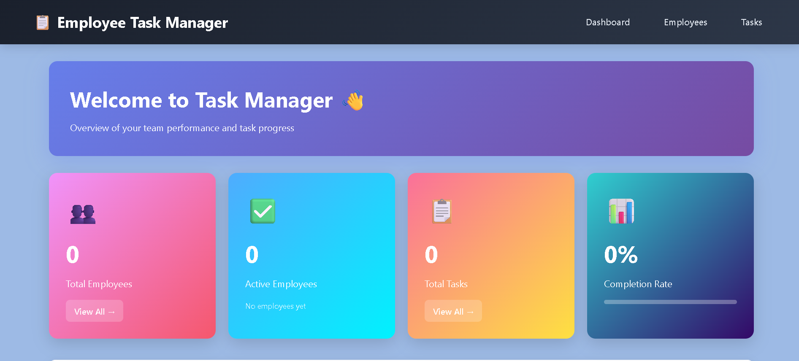
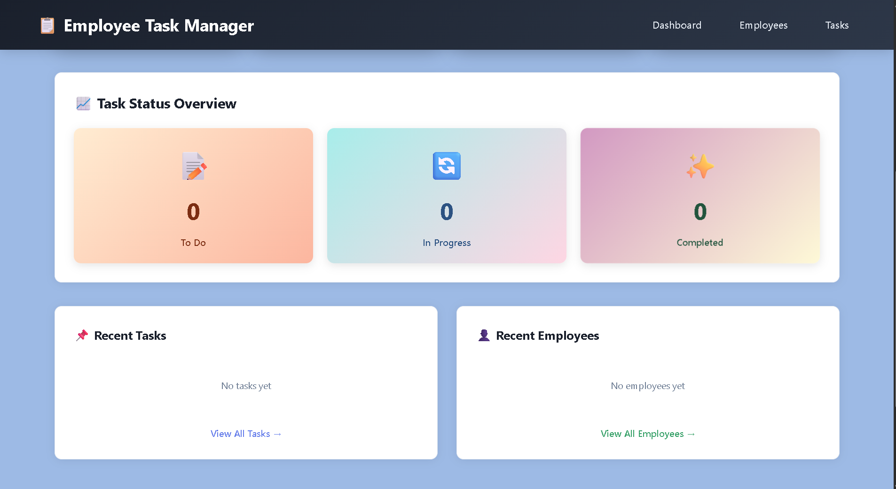
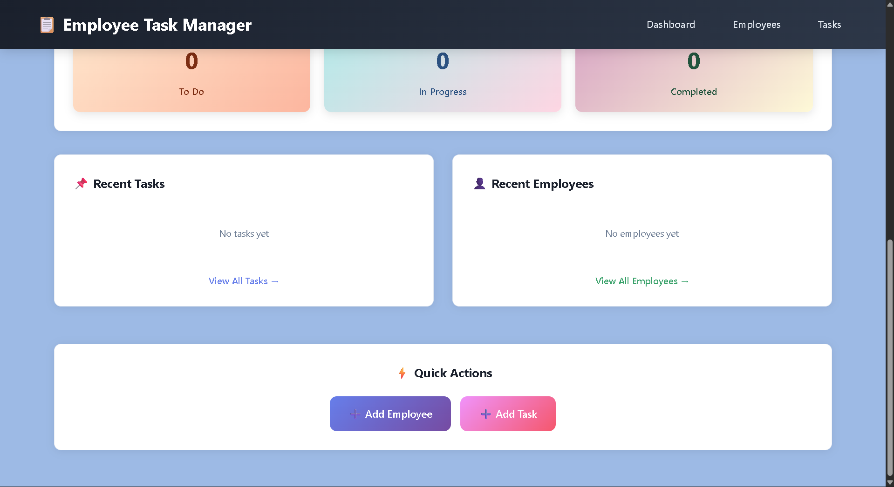
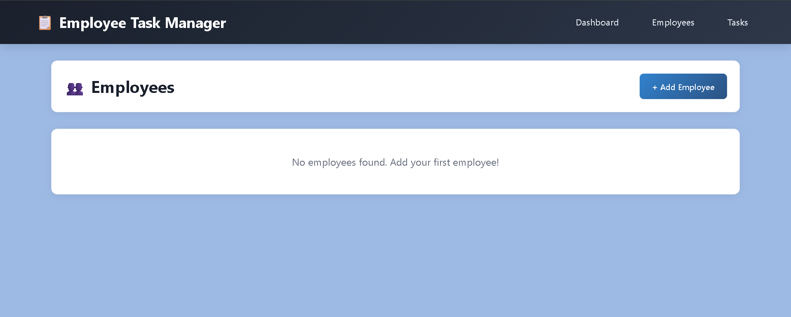

# 📋 Employee Task Management System

A full-stack web application for managing employees and tasks with real-time CRUD operations, built as part of ProU Technology Assessment.

## 🔗 Live Demo

**⚠ IMPORTANT:** Backend server may spin down due to inactivity on free tier. Please visit the backend URL first and wait for response before accessing frontend.

- **Frontend:** [https://employee-frontend-e4wd.onrender.com/](https://employee-frontend-e4wd.onrender.com/)
- **Backend API:** [https://employee-backend-nr15.onrender.com](https://employee-backend-nr15.onrender.com)
- **GitHub Repository:** [https://github.com/mycode100/Basic-Employee-Tasks-Managments](https://github.com/mycode100/Basic-Employee-Tasks-Managments)
- **Demo Video:** [Watch on Google Drive](https://drive.google.com/file/d/1L-2zivE4zDwIGGt-w5UkFzqysdgYcz79/view?usp=sharing)

### How to Access Live Demo:
1. First visit: [https://employee-backend-nr15.onrender.com](https://employee-backend-nr15.onrender.com)
2. Wait for backend response (may take 30-60 seconds on first load):
```json
{
  "success": true,
  "message": "Employee Task Management API - Backend Running",
  "environment": "production",
  "endpoints": {
    "employees": "/api/employees",
    "tasks": "/api/tasks"
  }
}
```
3. Then access frontend: [https://employee-frontend-e4wd.onrender.com/](https://employee-frontend-e4wd.onrender.com/)

---

## 📸 Screenshots

### Dashboard - Statistics Overview

Real-time statistics showing total employees, active employees, tasks, and completion rates

### Dashboard - Task Progress

Visual representation of task status breakdown (To Do, In Progress, Completed)

### Dashboard - Quick Actions

Quick access buttons for adding employees and tasks

### Employee Management Dashboard

Complete employee list with edit and delete functionality

### Add Employee Form

Form to add new employees with validation

### Employee Added Successfully

Updated employee list showing newly added employee

### Task Assignment Dashboard

Task management interface with assignment capabilities

### Task Assigned Successfully

Updated task list showing newly assigned task

### Final Dashboard View

Complete dashboard after adding employees and tasks

---

## 🚀 Tech Stack

### Frontend
- **Framework:** React 18.3.1
- **Build Tool:** Vite 6.0.1
- **Routing:** React Router DOM 7.1.1
- **HTTP Client:** Axios 1.7.9
- **Styling:** Custom CSS with gradients and animations
- **Deployment:** Render (Static Site)

### Backend
- **Runtime:** Node.js
- **Framework:** Express.js 4.21.2
- **Database:** MongoDB (Atlas Cloud)
- **ODM:** Mongoose 8.9.2
- **Middleware:** CORS, dotenv
- **Deployment:** Render (Web Service)

### Development Tools
- Git & GitHub
- VS Code
- Postman (API Testing)
- MongoDB Compass

---

## ✨ Features

### Core Features
✅ **Employee Management**
- Add new employees with name, email, role, department, and status
- Edit existing employee information
- Delete employees
- View all employees in a table format
- Filter by active/inactive status

✅ **Task Management**
- Create tasks with title, description, priority, and due date
- Assign tasks to specific employees
- Update task status (To Do, In Progress, Done)
- Edit and delete tasks
- Track task completion

✅ **Dashboard Analytics**
- Real-time statistics (total employees, active employees, total tasks)
- Task completion rate with progress bar
- Task status breakdown (To Do, In Progress, Completed)
- Recent activity feed for tasks and employees
- Quick action buttons

### Bonus Features Implemented
🎨 **Enhanced UI/UX**
- Modern gradient design with smooth animations
- Hover effects on all interactive elements
- Responsive design for mobile and desktop
- Color-coded priority and status badges
- Loading states and error handling

🔐 **Data Validation**
- Form validation on both frontend and backend
- Required field checks
- Email format validation
- Status and priority enums

📊 **Advanced Functionality**
- Employee-task relationship tracking
- Automatic statistics calculation
- Recent activity tracking
- Completion rate analytics

🌐 **Production Deployment**
- Deployed on Render (both frontend and backend)
- MongoDB Atlas cloud database
- CORS configuration for security
- Environment variable management

---

## 🛠 Setup Instructions

### Prerequisites
- Node.js (v18 or higher)
- MongoDB Atlas account (or local MongoDB)
- Git

### Clone Repository
```bash
git clone https://github.com/mycode100/Basic-Employee-Tasks-Managments.git
cd Basic-Employee-Tasks-Managments
```

### Backend Setup

1. Navigate to backend folder:
```bash
cd backend
```

2. Install dependencies:
```bash
npm install
```

3. Create `.env` file in backend folder:
```env
PORT=5000
MONGODB_URI=your_mongodb_connection_string
NODE_ENV=development
FRONTEND_URL=http://localhost:5173
```

4. Start backend server:
```bash
npm start
```

Backend will run on http://localhost:5000

### Frontend Setup

1. Navigate to frontend folder:
```bash
cd frontend
```

2. Install dependencies:
```bash
npm install
```

3. Create `.env` file in frontend folder:
```env
VITE_API_BASE_URL=http://localhost:5000/api
```

4. Start development server:
```bash
npm run dev
```

Frontend will run on http://localhost:5173

### Database Setup

1. Create MongoDB Atlas account at [https://www.mongodb.com/cloud/atlas](https://www.mongodb.com/cloud/atlas)
2. Create a new cluster
3. Create a database user with password
4. Get connection string and add to backend `.env` file
5. Whitelist your IP address in Network Access

---

## 📁 Project Structure

```
Basic-Employee-Tasks-Managments/
├── backend/
│   ├── config/
│   │   └── db.js                 # MongoDB connection
│   ├── models/
│   │   ├── Employee.js           # Employee schema
│   │   └── Task.js               # Task schema
│   ├── routes/
│   │   ├── employees.js          # Employee CRUD routes
│   │   └── tasks.js              # Task CRUD routes
│   ├── .env                      # Environment variables
│   ├── .gitignore
│   ├── package.json
│   └── server.js                 # Main server file
│
├── frontend/
│   ├── src/
│   │   ├── components/
│   │   │   ├── AddEmployeeForm.jsx
│   │   │   ├── AddTaskForm.jsx
│   │   │   ├── EmployeeTable.jsx
│   │   │   ├── TaskTable.jsx
│   │   │   └── Navbar.jsx
│   │   ├── pages/
│   │   │   ├── Dashboard.jsx
│   │   │   ├── Employees.jsx
│   │   │   └── Tasks.jsx
│   │   ├── services/
│   │   │   └── api.js            # Axios configuration
│   │   ├── App.jsx
│   │   ├── main.jsx
│   │   └── index.css
│   ├── .env
│   ├── .gitignore
│   ├── index.html
│   ├── package.json
│   └── vite.config.js
│
├── screenshots/                  # Application screenshots
├── .gitignore
└── README.md
```

---

## 🔌 API Endpoints

### Employee Endpoints
| Method | Endpoint | Description |
|--------|----------|-------------|
| GET | /api/employees | Get all employees |
| GET | /api/employees/:id | Get employee by ID |
| POST | /api/employees | Create new employee |
| PUT | /api/employees/:id | Update employee |
| DELETE | /api/employees/:id | Delete employee |

### Task Endpoints
| Method | Endpoint | Description |
|--------|----------|-------------|
| GET | /api/tasks | Get all tasks |
| GET | /api/tasks/:id | Get task by ID |
| POST | /api/tasks | Create new task |
| PUT | /api/tasks/:id | Update task |
| DELETE | /api/tasks/:id | Delete task |

### Example API Request
```json
// Create Employee
POST /api/employees
Content-Type: application/json

{
  "name": "John Doe",
  "email": "john@example.com",
  "role": "Software Engineer",
  "department": "Engineering",
  "status": "Active"
}
```

---

## 🎯 Assumptions & Design Decisions

### Assumptions
1. **User Authentication:** Not implemented as it wasn't specified in requirements. Can be added as future enhancement.
2. **Single Organization:** System assumes single organization/company usage.
3. **Task Assignment:** One task can be assigned to one employee at a time.
4. **Date Format:** Due dates use standard date picker format.
5. **Status Updates:** Task status can be manually updated by any user.

### Design Decisions
1. **Separation of Concerns:** Frontend and backend are completely decoupled for scalability.
2. **Component Structure:** Reusable components (tables, forms) for maintainability.
3. **Color Coding:** Visual indicators for status and priority for better UX.
4. **Responsive Design:** Mobile-first approach with breakpoints for larger screens.
5. **Error Handling:** User-friendly error messages with console logging for debugging.
6. **Loading States:** Visual feedback during API calls for better UX.

---

## 🏆 Bonus Challenges Completed

### 1. Multiple Track Completion ✅
- **Frontend Track:** Built responsive React UI with mock data capability
- **Backend Track:** Implemented RESTful APIs with MongoDB
- **Full-stack Track:** Integrated frontend and backend with real-time data

### 2. Deployment ✅
- Frontend deployed on Render
- Backend deployed on Render
- MongoDB hosted on Atlas Cloud
- All services live and accessible

### 3. Advanced UI Features ✅
- Gradient backgrounds and modern design
- Smooth hover animations and transitions
- Interactive dashboard with real-time statistics
- Color-coded priority and status badges
- Progress bars for visual data representation

### 4. Data Visualization ✅
- Real-time dashboard analytics
- Task completion rate calculation
- Status breakdown visualization
- Recent activity feeds

### 5. Creative UX ✅
- Quick action buttons on dashboard
- Inline edit/delete functionality
- Loading states during API calls
- Confirmation dialogs for delete operations
- Toast notifications for user actions

---

## 🧪 Testing

### Manual Testing Performed
✅ Create, Read, Update, Delete operations for Employees  
✅ Create, Read, Update, Delete operations for Tasks  
✅ Employee-Task relationship mapping  
✅ Dashboard statistics accuracy  
✅ Form validation and error handling  
✅ Responsive design on different screen sizes  
✅ API endpoint testing with Postman  
✅ Cross-browser compatibility (Chrome, Firefox, Edge)  

### Test Scenarios Covered
- Add employee with valid data
- Add employee with invalid email
- Edit employee information
- Delete employee with assigned tasks
- Create task without employee assignment
- Assign task to specific employee
- Update task status
- Dashboard statistics calculation
- API error handling
- CORS configuration

---

## 🚀 Deployment Guide

### Backend Deployment (Render)
1. Create Render account and connect GitHub
2. Create new Web Service
3. Select repository
4. Configure:
   - **Root Directory:** backend
   - **Build Command:** npm install
   - **Start Command:** npm start
5. Add environment variables
6. Deploy

### Frontend Deployment (Render)
1. Create new Static Site on Render
2. Select same repository
3. Configure:
   - **Root Directory:** frontend
   - **Build Command:** npm install && npm run build
   - **Publish Directory:** frontend/dist
4. Add environment variable with backend URL
5. Deploy

---

## 🔮 Future Enhancements

- User authentication and authorization
- Role-based access control (Admin, Manager, Employee)
- Email notifications for task assignments
- Task comments and attachments
- Task filtering and search functionality
- Export data to CSV/PDF
- Dark mode toggle
- Real-time updates using WebSockets
- Task priority escalation
- Employee performance analytics
- Calendar view for tasks
- Mobile app version

---

## 📝 Code Quality & Best Practices

### Implemented Best Practices
✅ **Clean Code:** Meaningful variable names, proper indentation, comments  
✅ **Modularity:** Reusable components and functions  
✅ **Error Handling:** Try-catch blocks, user-friendly error messages  
✅ **Security:** Environment variables, CORS configuration, input validation  
✅ **Performance:** Efficient database queries, lazy loading  
✅ **Responsive Design:** Mobile-first approach  
✅ **Version Control:** Proper Git commits and branches  

---

## 📄 License

This project is created for ProU Technology Assessment purposes.

---

## 👨‍💻 Developer

**Mopuru Venkata Srikanth Reddy**

- GitHub: [@mycode100](https://github.com/mycode100)
- Email: [Provide your email]

---

## 🙏 Acknowledgments

This project was developed as part of the ProU Technology Online Assessment for Full-stack Development position.

**Assessment Timeline:** November 26-28, 2025  
**Submitted to:** vasudharini.s@prou.com.au & pavithra.mannar@prou.com.au

---

## 📞 Support

For any queries regarding this project, please reach out through:
- GitHub Issues: [Create Issue](https://github.com/mycode100/Basic-Employee-Tasks-Managments/issues)
- Email: mvsr26032005@gmail.com

---

**Note:** This project demonstrates full-stack development skills including React, Node.js, Express, MongoDB, RESTful API design, responsive UI/UX, deployment, and documentation. All code is original and written specifically for this assessment.

---

Made with ❤️ for ProU Technology Assessment